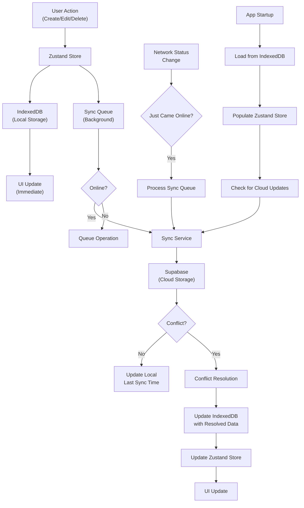

# Notes App Implementation Plan

## 🎯 Project Overview

Building a local-first note-taking application with rich text editing, organization features, and PWA capabilities. Designed to be extensible for future spaced repetition features.

## 🏗️ Tech Stack Foundation

- **Framework**: Next.js 14 (App Router)
- **Language**: TypeScript
- **Styling**: Tailwind CSS
- **Rich Text**: SlateJS with slate-history
- **Icons**: Lucide React
- **Storage**: Dexie.js (IndexedDB) → Cloud Sync (Phase 4)
- **State**: Zustand (from Phase 1)
- **PWA**: Next.js PWA capabilities

## 📊 Core Data Models

```typescript
interface Note {
  id: string;
  title: string;
  content: SlateNode[];
  createdAt: Date;
  updatedAt: Date;
}

interface Notecard {
  id: string;
  front: string;
  back: string;
  createdAt: Date;
  updatedAt: Date;
}

// Custom Slate element for embedding notecards
interface NotecardEmbedElement {
  type: 'notecard-embed';
  notecardId: string;
  children: [{ text: '' }]; // Required by Slate
}
```

## 🚀 Implementation Phases

### Phase 1: Foundation ✅ COMPLETED

**Goal**: Basic working note-taking app

#### Core Infrastructure

- [x] Next.js 14 project setup
- [x] Essential dependencies installed (including Dexie)
- [x] Development workflow setup (ESLint, TypeScript, git hooks)
- [x] Create core types and interfaces
- [x] Project structure and types
- [x] Basic layout with sidebar
- [x] Dexie database setup and persistence

#### Minimal Features

- [x] Create new notes
- [x] Edit notes (rich text with Slate.js)
- [x] Delete notes
- [x] List all notes
- [x] Auto-save functionality (real-time on every keystroke)

#### File Structure

```
src/
├── app/
│   ├── layout.tsx
│   ├── page.tsx
│   └── globals.css
├── components/
│   ├── layout/
│   │   ├── Sidebar.tsx
│   │   └── Header.tsx
│   ├── editor/
│   │   └── SimpleEditor.tsx
│   └── notes/
│       ├── NotesList.tsx
│       └── NoteItem.tsx
├── hooks/
│   └── useDatabase.ts
├── store/
│   └── notesStore.ts
├── lib/
│   └── database.ts
├── types/
│   └── index.ts
└── utils/
    └── helpers.ts
```

### Phase 2: Enhanced Editing ✅ COMPLETED

**Goal**: Rich text editing with SlateJS

#### Rich Text Features

- [x] SlateJS editor implementation
- [x] Basic formatting (bold, italic, underline)
- [x] Headings (H1, H2, H3) with proper styling
- [x] Lists (bulleted and numbered)
- [x] Markdown shortcuts (# for headings, \* for lists, etc.)
- [x] Comprehensive toolbar with formatting options
- [x] Keyboard shortcuts (Ctrl/Cmd + B, I, U)
- [x] Clean, extensible architecture with separate utilities

#### Core Features

- [x] Local text search (title + content)
- [x] Sorted by last edited

### Phase 3: Polish & PWA ✅ COMPLETED

**Goal**: Production-ready app with offline capabilities

#### User Experience

- [x] Dark/light theme toggle
- [x] Responsive design (already implemented)
- [x] Keyboard shortcuts (already implemented)

#### PWA Features ✅ COMPLETED

- [x] Service worker setup
- [x] Offline functionality
- [x] Install prompts
- [x] Background sync preparation

### Phase 4: Advanced Features

**Goal**: Advanced note-taking capabilities

#### Import/Export

- [ ] Markdown import/export
- [ ] JSON backup/restore
- [ ] Note sharing capabilities

### Phase 5: Notecards & Spaced Repetition Foundation ✅ COMPLETED

**Goal**: Implement notecards as standalone entities with embedded support in notes

#### Data Architecture

- [x] Extend database schema to include notecards table
- [x] Create normalized data model with proper relationships
- [ ] Implement bidirectional sync between standalone and embedded notecards
- [x] Add notecard-specific database operations (CRUD)

#### Core Notecard Features

- [x] Notecard creation and editing interface
- [x] Notecard list view with search/filter capabilities
- [x] Delete notecard functionality with proper cleanup
- [x] Simple front/back text content (foundation for rich text later)

#### Slate Integration

- [x] Create custom notecard embed Slate element
- [x] Implement notecard embed rendering in editor
- [x] Add toolbar button/shortcut for inserting notecard embeds
- [x] Handle notecard selection and inline editing
- [x] **REFACTORED**: Simplified design with table-like layout (front/back rows)
- [x] **ENHANCED**: Direct inline editing within notes (click to edit front/back)
- [x] **STREAMLINED**: Auto-save on blur, removed unnecessary help text and keyboard shortcuts
- [x] **COMPONENTIZED**: Extracted reusable NotecardField component for consistent behavior
- [x] **SIMPLIFIED CREATION**: Toolbar button now creates new notecard directly instead of searching
- [x] **AUTO-FOCUS**: New notecards automatically focus the front field for immediate editing
- [x] **TAB NAVIGATION**: Tab moves from front→back, Shift+Tab moves back→front
- [x] **TAB EXIT**: Tab from back field exits notecard and moves cursor below the block
- [x] **AUTO-CLEANUP**: Empty notecards are automatically deleted when abandoned to prevent library clutter
- [x] **REAL-TIME UPDATES**: Cascade deletion removes notecard embeds from notes immediately without requiring refresh

#### State Management

- [x] Extend Zustand store with notecard operations
- [x] Implement real-time sync between embedded and standalone views
- [x] Add notecard search functionality
- [x] Consistent auto-save experience across notes and notecards
- [x] Optimize re-renders for embedded notecard updates

#### User Interface

- [x] Notecard management page/section
- [x] Embedded notecard styling (card-like appearance with border/shadow)
- [x] Responsive design for notecard views
- [x] Basic notecard preview in embed
- [x] Navigation between Notes and Notecards in sidebar
- [x] Unified sidebar experience for both notes and notecards
- [x] Consistent editor styling and behavior

#### File Structure Extensions

```
src/
├── components/
│   ├── notecards/
│   │   ├── NotecardsList.tsx
│   │   ├── NotecardItem.tsx
│   │   ├── NotecardEditor.tsx
│   │   └── NotecardEmbed.tsx
│   └── editor/
│       └── elements/
│           └── NotecardEmbedElement.tsx
├── hooks/
│   └── useNotecards.ts
├── store/
│   └── notecardsStore.ts
└── types/
    └── notecards.ts
```

#### Technical Considerations

- [x] **Data Integrity**: Ensure embedded notecards stay in sync with originals
- [x] **Performance**: Efficient updates when notecard is changed
- [x] **Validation**: Prevent circular references and invalid embeds
- [x] **Cleanup**: Handle orphaned embeds when notecards are deleted (CASCADE DELETE)

### Phase 6: Database Schema Migration (User-Keyed Data) ✅ COMPLETED

**Goal**: Prepare database for multi-user support by adding user ownership to all entities

#### Database Schema Changes

- [x] Add `user_id` field to notes table with NOT NULL constraint
- [x] Add `user_id` field to notecards table with NOT NULL constraint
- [x] Update database operations to filter by user_id
- [x] Add database indexes for user_id fields for performance
- [x] Create database migration utilities for existing data
- [x] Update TypeScript types to include user_id

#### Application Updates

- [x] Update Zustand stores to include user context
- [x] Modify all database queries to include user_id filtering
- [x] Update component props to handle user-scoped data
- [x] Add temporary hardcoded user_id for single-user testing
- [x] Test all CRUD operations with user-scoped data

#### Data Migration Strategy

- [x] Create migration script to assign existing notes/notecards to default user
- [x] Backup existing local data before schema changes
- [x] Implement rollback strategy for failed migrations
- [x] Test migration with development data

### Phase 7: Deployment & Hosting Setup ✅ COMPLETED

**Goal**: Deploy application to production with Vercel + Supabase

#### Deployment Infrastructure

- [x] **Supabase Project Setup**
  - [x] Create Supabase project
  - [x] Set up PostgreSQL database schema
  - [x] Configure database tables (notes, notecards)
  - [x] Disable Row Level Security for development
  - [x] Set up database connection from application
  - [x] Test database operations in development

#### Cloud Database Setup

- [x] **Supabase Database Configuration**
  - [x] Apply initial schema migration
  - [x] Configure environment variables
  - [x] Set up database adapter for local/cloud switching
  - [x] Update application stores to use Supabase
  - [x] Test CRUD operations (notes and notecards)

#### Environment Configuration

- [x] Set up environment variables for development
- [x] Configure database connection strings
- [x] Test application with cloud database
- [ ] Configure production environment variables
- [ ] Set up monitoring and error reporting
- [ ] Configure backup and recovery procedures

#### Vercel Deployment ✅ COMPLETED

- [x] **Vercel Deployment**
  - [x] Connect GitHub repository to Vercel
  - [x] Configure build settings and environment variables
  - [x] Set up automatic deployments on git push
  - [x] Configure custom domain (teal.so)
  - [x] Test production build and deployment

### Phase 8: User Authentication System ✅ COMPLETED

**Goal**: Implement full user authentication with Supabase Auth

#### Authentication Setup

- [x] **Supabase Auth Configuration**
  - [x] Enable email/password authentication
  - [x] Configure OAuth providers (Google, GitHub)
  - [x] Set up email templates and SMTP
  - [x] Configure authentication redirect URLs
  - [x] Test authentication flow in development

#### Frontend Authentication

- [x] Install and configure Supabase Auth UI components
- [x] Create login/signup pages with pre-built components
- [x] Implement authentication state management
- [x] Add protected routes and navigation guards
- [x] Create user profile management interface
- [x] Implement logout functionality

#### Backend Integration

- [x] Update database operations to use authenticated user_id
- [x] Remove hardcoded user_id from Phase 6
- [x] Implement Row Level Security policies for data isolation
- [x] Add authentication middleware for API routes
- [x] Test multi-user data isolation

#### User Experience

- [x] Implement seamless login/logout experience
- [x] Add user profile display in header/sidebar
- [x] Create user settings page
- [x] Implement password reset functionality
- [x] Add email verification flow

### Phase 9: Hybrid Offline-First Architecture ← **WE ARE HERE**

**Goal**: Implement straightforward offline-first architecture with background cloud sync

#### Architecture Overview

**Core Principle**: Zustand stores ALWAYS work with IndexedDB locally, with background sync to Supabase.

```
User Action → Zustand Store → IndexedDB → Immediate UI Update
                    ↓
              Sync Queue → Background Sync → Supabase
```

#### Benefits of This Approach

✅ **Always works offline** (IndexedDB is always available)  
✅ **Instant UI updates** (no waiting for network)  
✅ **Simple Zustand integration** (single local database layer)  
✅ **Easy development** (no conditional database logic)  
✅ **Automatic conflict resolution** (with user control when needed)  
✅ **Background sync** (doesn't block user actions)

#### Implementation Strategy

**Phase 9.1: Simplify Database Layer** ✅ COMPLETED

- [x] Remove database adapter switching logic (`USE_SUPABASE` flag)
- [x] Always use IndexedDB for immediate operations
- [x] Update Zustand stores to only work with local database
- [x] Remove cloud database calls from store actions
- [x] Simplify database imports and dependencies

**Phase 9.2: Create Sync Service** ✅ COMPLETED

- [x] Create `SyncService` class for background operations
- [x] Implement sync queue for offline operations
- [x] Add network status detection
- [x] Create batch sync operations for efficiency
- [x] Implement incremental sync with timestamps

**Phase 9.2.1: Sync Integration** ✅ COMPLETED

- [x] Integrate sync service into notes store (CREATE, UPDATE, DELETE)
- [x] Integrate sync service into notecards store (CREATE, UPDATE, DELETE)
- [x] Add initial sync on user authentication
- [x] Create sync status UI component
- [x] Add sync status to sidebar

**Phase 9.3: Conflict Resolution**

- [ ] Implement last-write-wins for simple conflicts
- [ ] Add manual conflict resolution UI for complex cases
- [ ] Create merge strategies for note content
- [ ] Add conflict detection and user notification

**Phase 9.4: Sync Status & UI** ✅ COMPLETED

- [x] Add sync status to Zustand stores
- [x] Create sync status indicators in UI
- [x] Add manual sync trigger button
- [x] Implement sync progress feedback
- [x] Add offline/online status indicators

**Phase 9.5: Background Sync Implementation** ✅ COMPLETED

- [x] Set up periodic background sync (every 5 minutes)
- [x] Implement retry logic with exponential backoff
- [x] Add sync on network reconnection
- [x] Create sync on app focus/visibility change
- [x] Add sync queue persistence across app restarts

#### Technical Architecture

**Data Flow Diagram**:



#### New File Structure

```
src/
├── lib/
│   ├── sync/
│   │   ├── SyncService.ts          # Main sync orchestrator
│   │   ├── SyncQueue.ts            # Queue management
│   │   ├── ConflictResolver.ts     # Conflict resolution logic
│   │   └── NetworkMonitor.ts       # Network status detection
│   ├── database.ts                 # IndexedDB only (simplified)
│   └── supabase.ts                 # Cloud operations only
├── store/
│   ├── notesStore.ts              # Simplified - IndexedDB only
│   ├── notecardsStore.ts          # Simplified - IndexedDB only
│   └── syncStore.ts               # New - sync status management
└── hooks/
    ├── useSync.ts                 # Sync operations hook
    └── useNetworkStatus.ts        # Network status hook
```

#### Zustand Store Simplification

**Before (Complex)**:

```typescript
// Complex conditional database logic
const database = USE_SUPABASE ? supabaseDB : indexedDB;
const notes = await database.getAllNotes(userId);
```

**After (Simple)**:

```typescript
// Always use local database
const notes = await notesDatabase.getAllNotes(userId);
// Sync happens automatically in background
```

#### Implementation Details

**1. Simplified Database Layer**

- Remove `database-adapter.ts` complexity
- Always use IndexedDB for store operations
- Move cloud operations to dedicated sync service
- Single source of truth: local database

**2. Background Sync Service**

```typescript
class SyncService {
  private syncQueue: SyncQueue;
  private conflictResolver: ConflictResolver;

  async syncNotes(userId: string): Promise<void>;
  async syncNotecards(userId: string): Promise<void>;
  async processQueue(): Promise<void>;
  async resolveConflicts(): Promise<void>;
}
```

**3. Sync Queue Management**

```typescript
interface SyncOperation {
  id: string;
  type: 'CREATE' | 'UPDATE' | 'DELETE';
  table: 'notes' | 'notecards';
  data: any;
  timestamp: Date;
  retryCount: number;
}
```

**4. Conflict Resolution Strategy**

- **Last-write-wins**: Default for most conflicts
- **Manual resolution**: For complex content conflicts
- **Merge strategies**: For note content using operational transforms
- **User notification**: When manual intervention needed

#### Success Metrics

- [ ] All store operations work offline immediately
- [ ] Background sync works without blocking UI
- [ ] Conflicts are resolved automatically or with clear user prompts
- [ ] Sync status is always visible and accurate
- [ ] No data loss during offline/online transitions
- [ ] Development workflow is simplified (no conditional database logic)

#### Migration Strategy

1. **Preserve existing data**: Ensure no data loss during migration
2. **Gradual rollout**: Implement in phases to test each component
3. **Fallback mechanism**: Ability to rollback if issues arise
4. **User communication**: Clear sync status and any required actions

### Phase 10: Advanced Features & Polish

**Goal**: Advanced features and production readiness

#### Advanced Storage Features

- [ ] Full-text search indexing with PostgreSQL
- [ ] Query optimization and performance tuning
- [ ] Bulk operations and batch processing
- [ ] Advanced filtering and sorting options

#### PWA & Offline Features

- [ ] Service worker setup for offline functionality
- [ ] Install prompts and PWA manifest
- [ ] Background sync capabilities
- [ ] Offline-first architecture refinement

## 🎯 Immediate Goals

### Project Structure

- [x] Set up development workflow (linting, type-checking, git hooks)
- [x] Create core types and interfaces
- [x] Set up Dexie database class
- [x] Set up basic layout components
- [x] Set up Zustand store with async operations

### Basic CRUD ✅ COMPLETED

- [x] Note creation functionality
- [x] Rich text editor (SlateJS with structured content)
- [x] Note listing component with real-time preview
- [x] Delete functionality

### Core Features

- [x] Auto-save implementation (real-time on every keystroke)
- [x] Dark/light theme toggle (Phase 3)
- [x] **Notecards system implementation** ✅ COMPLETED
- [x] **Database Schema Migration (Phase 6)** ✅ COMPLETED
- [x] **Supabase Setup & Cloud Database (Phase 7)** ✅ COMPLETED
- [x] **User Authentication (Phase 8)** ✅ COMPLETED
- [x] **Production Deployment & Hosting** ✅ COMPLETED
- [x] **Cloud Sync Implementation (Phase 9)** ← Happy path complete
- [ ] Basic local text search
- [ ] Polish and testing

## 🤖 AI Development Workflow

### Node.js Version Management

- **Required version**: Node.js 20+ for Next.js compatibility
- **Check version**: Use `node --version` to confirm correct version is active

### Quality Assurance Protocol

- **Before each commit**: Run `npm run check-all` to verify all quality checks pass
- **Ask before committing**: Always confirm with user before running `git commit`
- **Check off completed tasks**: Update plan.md checkboxes as features are completed
- **Test immediately**: Run relevant tests after implementing new features
- **Write comprehensive tests**: Every new feature should have corresponding tests
- **Minimal mocking**: Use mocks sparingly and only when absolutely necessary
- **Fix, don't mock**: When tests fail, fix the underlying issue rather than mocking it away
- **Never use `any`**: Always use proper TypeScript types - create specific interfaces, union types, or use generics instead of `any`

### Commit Guidelines

- **Small, focused commits**: Each commit should represent one logical change
- **Descriptive messages**: Clear commit messages describing what was implemented
- **Quality gates**: Pre-commit hooks automatically run linting, formatting, and tests
- **User confirmation**: Ask "Ready to commit these changes?" before proceeding

### Progress Tracking

- **Update checkboxes**: Mark completed items as [x] in plan.md
- **Document decisions**: Update technical decisions section when architecture changes
- **Note blockers**: Clearly communicate any issues or dependencies

### Testing Guidelines

- **Test-driven approach**: Write tests for all new functionality
- **Test BEHAVIOR, not INTERFACE**: Tests must verify actual functionality, not just function signatures
  - ❌ BAD: `expect(result).toBe(true)` (tests return value)
  - ✅ GOOD: `expect(editor.children[0].type).toBe('bulleted-list')` (tests actual transformation)
  - ❌ BAD: `expect(mockFunction).toHaveBeenCalled()` without verifying side effects
  - ✅ GOOD: Verify the actual state changes, DOM updates, or data transformations
- **Real integration tests**: Test actual database operations, not mocked versions
- **Fix configuration issues**: When tests fail due to setup/config, fix the root cause
- **Avoid mock solutions**: Mocks should be used only for external services, not internal logic
- **Test edge cases**: Include error handling, boundary conditions, and failure scenarios
- **Maintain test coverage**: Ensure all critical paths are tested
- **Failing tests first**: When implementing new features, write a failing test that verifies the expected behavior before implementing

### Development Cycle

1. **Write failing test**: Create a test that verifies the expected behavior (should fail initially)
2. **Implement feature**: Write code following our established patterns to make the test pass
3. **Verify behavior**: Ensure tests check actual functionality, not just interfaces
4. **Run quality checks**: `npm run check-all` to verify everything works
5. **Update plan**: Check off completed items in plan.md
6. **Ask user**: "Ready to commit [description of changes]?"
7. **Commit**: Only after user approval

## 🔧 Development Workflow & Quality

### Automated Quality Checks

- **ESLint**: Run on every file change to catch style/logic issues
- **TypeScript**: Continuous type checking for type safety
- **Tests**: Run relevant tests on code changes
- **Pre-commit hooks**: Prevent committing broken code

### Development Scripts

```json
{
  "scripts": {
    "dev": "next dev",
    "build": "next build",
    "lint": "next lint",
    "lint:fix": "next lint --fix",
    "type-check": "tsc --noEmit",
    "test": "jest",
    "test:watch": "jest --watch",
    "check-all": "npm run type-check && npm run lint && npm run test"
  }
}
```

### Git Hooks Setup

- **Pre-commit**: Run linting and type checks on staged files
- **Pre-push**: Run full test suite
- **Tools**: Husky + lint-staged for automated workflow

### IDE Integration

- **VS Code settings**: Auto-fix on save, format on save
- **Extensions**: ESLint, TypeScript, Prettier
- **Real-time feedback**: Immediate error highlighting

## 🔄 Development Principles

### Extensibility Focus

- Keep components modular and reusable
- Design data structures for future features
- Use composition over inheritance
- Plan for offline-first architecture

### Performance Considerations

- Lazy load components where possible
- Debounce search and auto-save
- Optimize re-renders with proper memoization
- Consider virtual scrolling for large note lists

### User Experience

- Immediate feedback for all actions
- Graceful error handling
- Intuitive keyboard shortcuts
- Responsive design from the start

## 🛠️ Technical Decisions

### Why This Tech Stack?

- **Next.js**: Future-proof, great PWA support, can add API routes later
- **SlateJS**: Most extensible rich text editor for React
- **Dexie.js**: Clean IndexedDB abstraction from the start
- **Zustand**: Excellent performance with selective subscriptions, built-in async support

### Future Extensibility Points

- Plugin architecture for editor features
- Modular storage adapters (local, cloud, sync)
- Component composition for different note types
- Event-driven architecture for feature additions
- Rich text support for notecard front/back content
- Spaced repetition algorithms and scheduling
- Notecard templates and categories

## 📈 Success Metrics

- [x] Can create and edit notes reliably
- [x] App works completely offline
- [ ] Fast search across all notes
- [x] Intuitive user interface
- [ ] Ready for cloud sync integration

---

**Next Step**: Begin Phase 1 implementation starting with project structure and types.
